# Implementasi Optimasi Kinerja Game

## Object Pooling
Dibutuhkan karena mushroom dispawn terus menerus. Apabila terus dibiarkan, komputer akan kehabisan memori. Gunakan Object Pooling untuk menggunakan kembali resource yang ada.

### Before
Memory
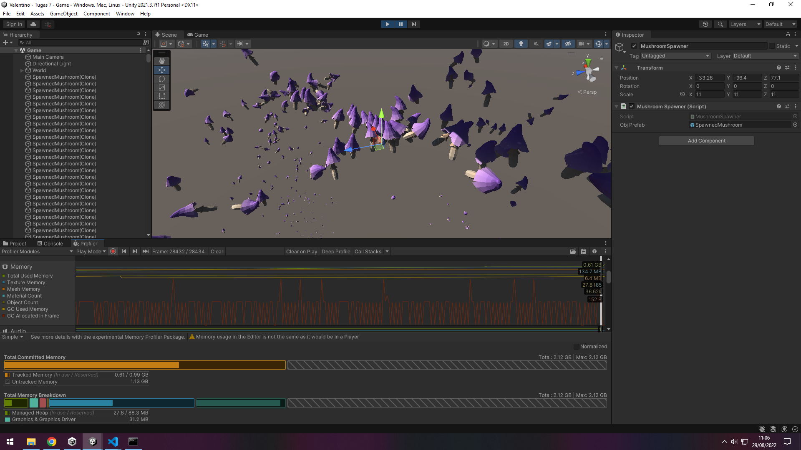

Physics
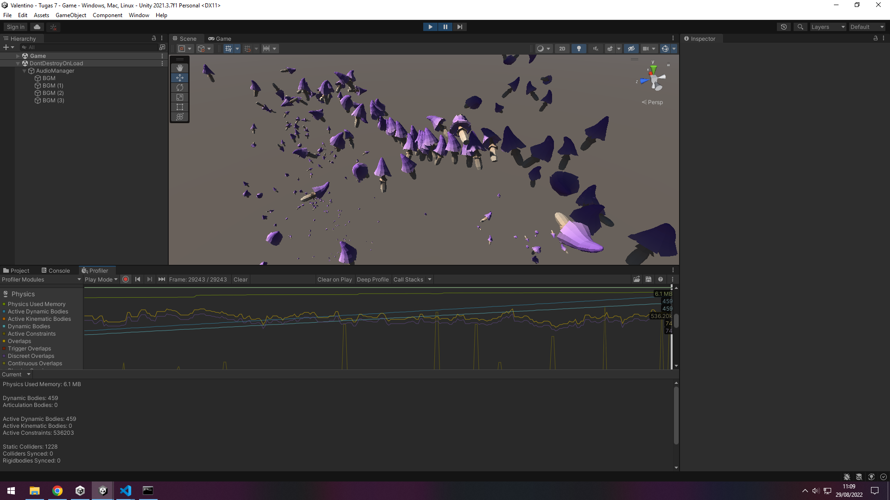

Rendering
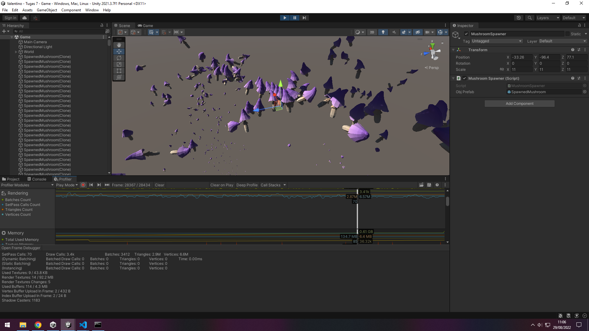

### After
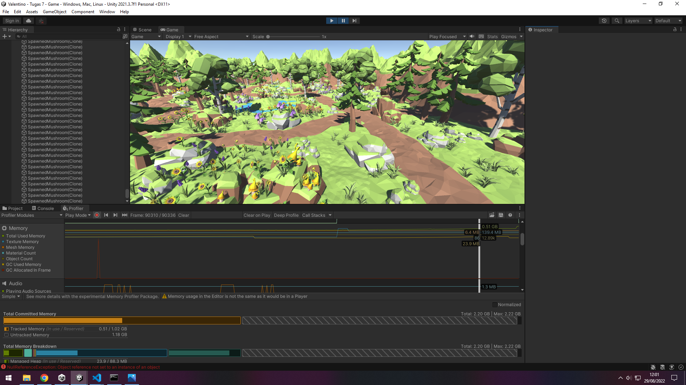

Physics
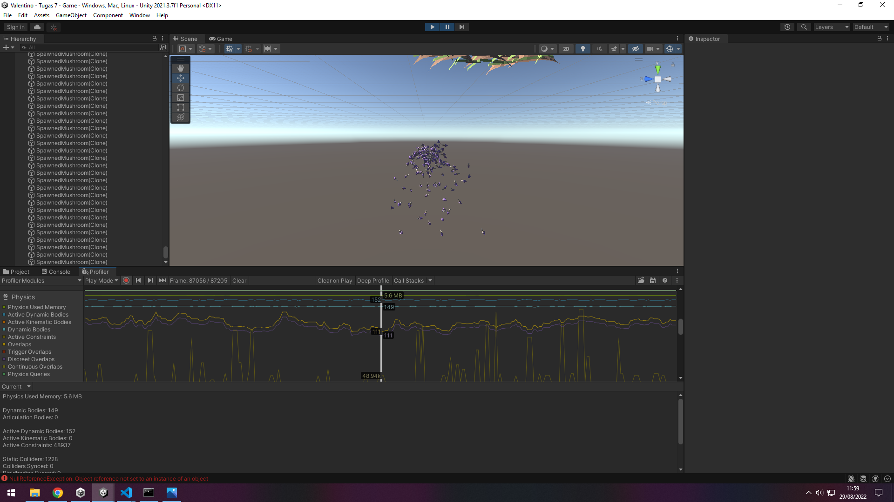

Rendering
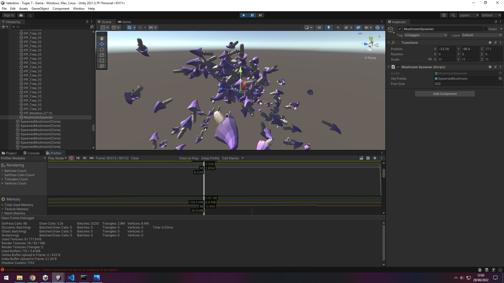

## Optimasi Audio Clip
File audio membutuhkan resource yang cukup besar. Padahal tidak semua clip audio digunakan. Optimasi dilakukan untuk menghemat memory.

### Before
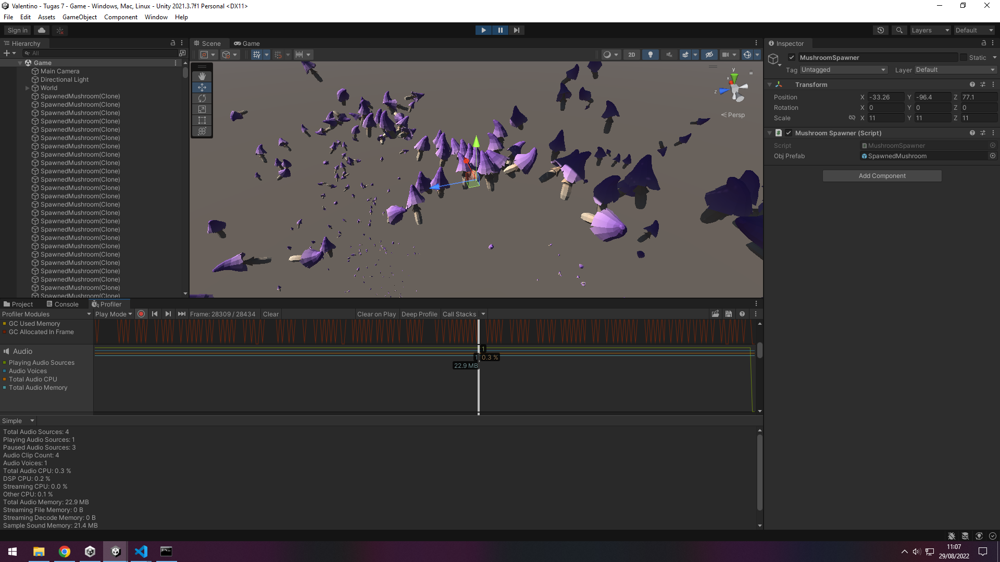

### After
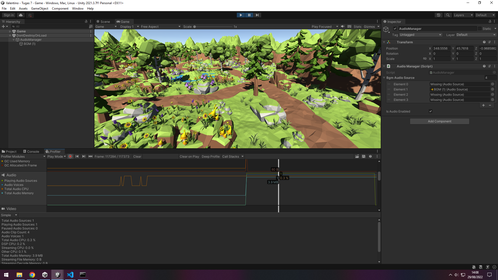

## Texture Atlas
Untuk menurunkan jumlah batches dan setpass call, kita bisa menggunakan Texture Atlas. Di kasus ini hanya ada sedikit perubahan, perubahan akan lebih terlihat untuk kasus game yang menggunakan banyak resource 2D.

### Before

### After
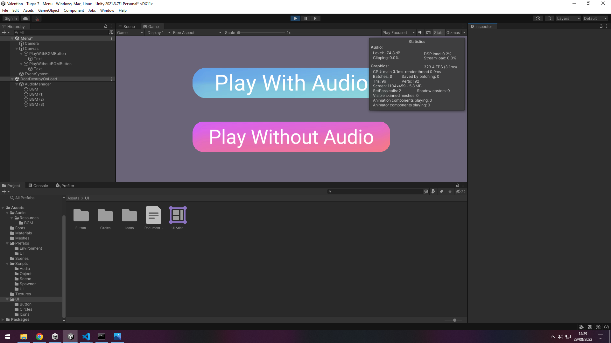

## Static Batching
Terdapat banyak resource statis yang bisa dirender secara batch agar lebih efisien. Namun di kasus saya, penggunaan static batching justru menurunkan performa game. Sehingga untuk masalah ini saya menggunakan GPU Instancing. Hasilnya adalah peningkatan fps dan penurutan jumlah batch.

### Before
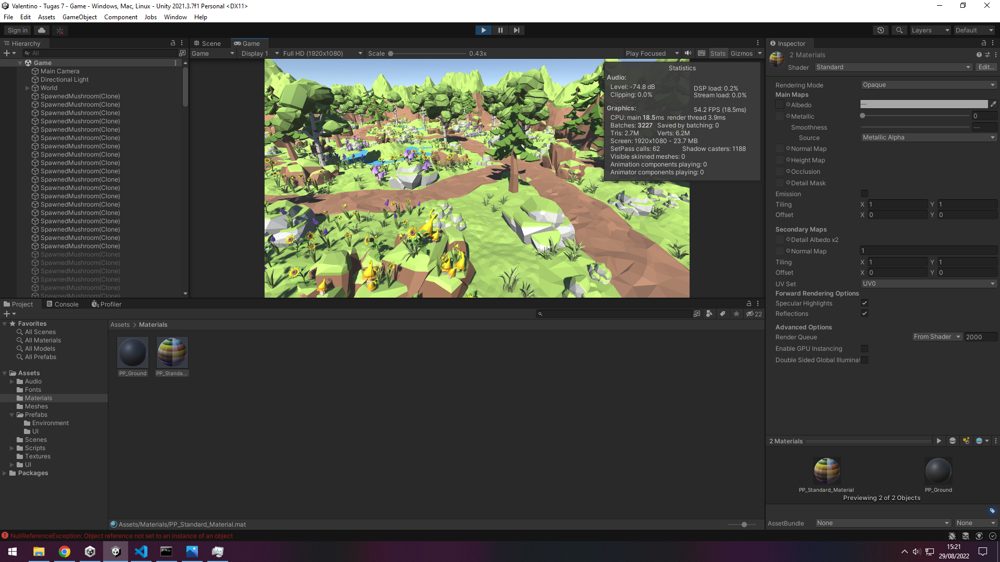

### After GPU Instancing
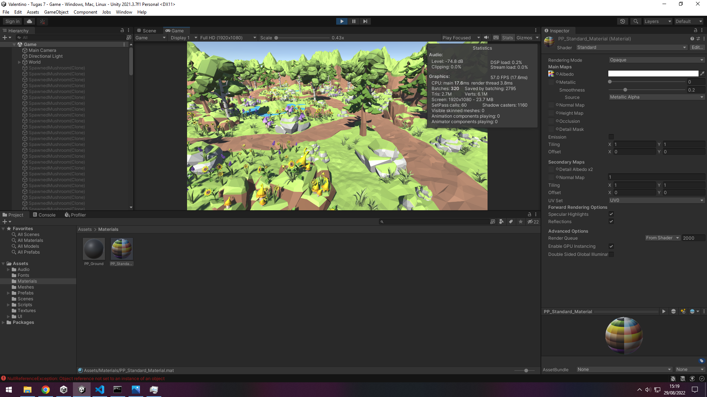

### After Static Batching
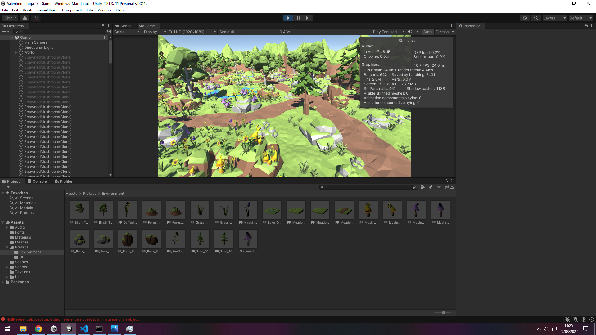